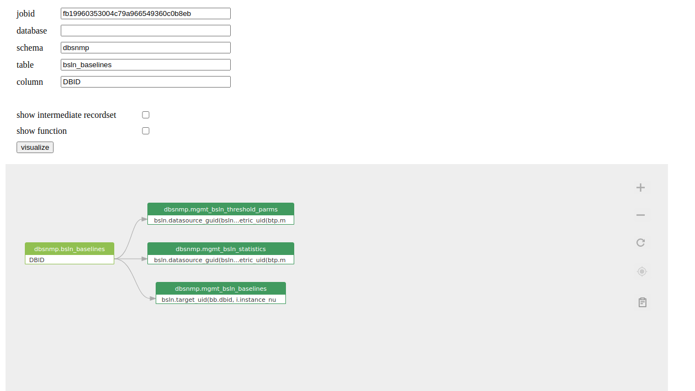

# Usages

## Visualize sqltext

Visualize the data lineage after analyzing the input SQL query.

* input: SQL text
* output: data lineage diagram

All necessary files are under this directory.

```
└── 1\
```

<figure><figcaption></figcaption></figure>

```javascript
$(async () => {
    // get a instance of SQLFlow
    const sqlflow = await SQLFlow.init({
        container: document.getElementById('sqlflow'),
        width: 1000,
        height: 315,
        apiPrefix: 'http://xxx.cn/api',
        token: '', // input your token
    });

    // set dbvendor property
    sqlflow.vendor.set('oracle');

    // set sql text property
    sqlflow.sqltext.set(`CREATE VIEW vsal 
    AS 
      SELECT a.deptno                  "Department", 
             a.num_emp / b.total_count "Employees", 
             a.sal_sum / b.total_sal   "Salary" 
      FROM   (SELECT deptno, 
                     Count()  num_emp, 
                     SUM(sal) sal_sum 
              FROM   scott.emp 
              WHERE  city = 'NYC' 
              GROUP  BY deptno) a, 
             (SELECT Count()  total_count, 
                     SUM(sal) total_sal 
              FROM   scott.emp 
              WHERE  city = 'NYC') b 
    ;`);

    sqlflow.visualize();
});

```

## **Visualize job**

Visualize the data lineage in a [SQLFlow Job](https://docs.gudusoft.com/introduction/getting-started/different-modes-in-gudu-sqlflow). The SQLFlow job must be already created.

* input: a SQLFlow job id, or leave it empty to view the latest job
* output: data lineage diagram

All necessary files are under this directory.

```
└── 2\
```

```javascript
$(async () => {
    const sqlflow = await SQLFlow.init({
        container: document.getElementById('demo-2'),
        width: 1000,
        height: 800,
        apiPrefix: 'http://xxx.com/api',
    });

    // view job detail by job id, or leave it empty to view the latest job
    await sqlflow.job.lineage.viewDetailById('b38273ec356d457bb98c6b3159c53be3');
});
```

<figure><figcaption></figcaption></figure>

## **Visualize job with hardcoded parameters**

Visualize the data lineage of a specified table or column in a SQLFlow job.

* input: a SQLFlow job id, or leave it empty to view the latest job
* input: database, schema, table, column.
  * If the column is omitted, return the data lineage for the specified table.
  * if the table and column are ommited, return the data lineage for the specified schema.
  * if the schema, table and column are ommited, return the data lineage for the specified database.
* output: data lineage diagram

All necessary files are under this directory.

```
└── 3\
```

```javascript
$(async () => {
    const sqlflow = await SQLFlow.init({
        container: document.getElementById('sqlflow'),
        width: 1000,
        height: 700,
        apiPrefix: 'http://xxx.cn/api',
    });

    // view job detail by job id, or leave it empty to view the latest job
    await sqlflow.job.lineage.viewDetailById('b38273ec356d457bb98c6b3159c53be3');

    sqlflow.job.lineage.selectGraph({
        database: 'DWDB', //
        schema: 'DBO',
        table: '#TMP',
        column: 'NUMBER_OFOBJECTS',
    });
});
```

## **Visualize job with parameters**

Visualize the data lineage of a specified table or column in a SQLFlow job.

* input: a SQLFlow job id, or leave it empty to view the latest job
* input: database, schema, table, column.
  * If the column is omitted, return the data lineage for the specified table.
  * if the table and column are ommited, return the data lineage for the specified schema.
  * if the schema, table and column are ommited, return the data lineage for the specified database.
* output: data lineage diagram

All necessary files are under this directory.

```
└── 4\
```

<figure><figcaption></figcaption></figure>

```javascript
$(async () => {
    const $jobid = $('#jobid');
    const $database = $('#database');
    const $schema = $('#schema');
    const $table = $('#table');
    const $column = $('#column');
    const $recordset = $('#recordset');
    const $function = $('#function');
    const $visualize = $('#visualize');

    const sqlflow = await SQLFlow.init({
        container: document.getElementById('sqlflow'),
        width: 1200,
        height: 800,
        apiPrefix: 'http://xxx.com/api',
        token: '', // input your token
    });

    const visualize = async () => {
        // reset default option
        $recordset.prop('checked', false);
        $function.prop('checked', false);

        // view job detail by job id, or leave it empty to view the latest job
        await sqlflow.job.lineage.viewDetailById($jobid.val());

        sqlflow.job.lineage.selectGraph({
            database: $database.val(),
            schema: $schema.val(),
            table: $table.val(),
            column: $column.val(),
        });
    };

    visualize();

    $visualize.click(visualize);

    $recordset.change(() => {
        const checked = $recordset.prop('checked');
        sqlflow.setting.showIntermediateRecordset.set(checked);
    });

    $function.change(() => {
        const checked = $function.prop('checked');
        sqlflow.setting.showFunction.set(checked);
    });
});

```

## **Set data lineage options of SQL query**

Using the setting to control the output of data lineage of a SQL query.

All necessary files are under this directory.

```
└── 5\
```

```javascript
$(async () => {
    const $sqltext = $('#sqltext');
    const $dataflow = $('#dataflow');
    const $impact = $('#impact');
    const $args = $('#args');
    const $recordset = $('#recordset');
    const $function = $('#function');
    const $constant = $('#constant');
    const $transform = $('#transform');
    const $visualize = $('#visualize');
    const $visualizeTableLevel = $('#visualizeTableLevel');

    // get a instance of SQLFlow
    const sqlflow = await SQLFlow.init({
        container: document.getElementById('sqlflow'),
        width: 1000,
        height: 800,
        apiPrefix: 'http://xxx.cn/api',
        token: '', // input your token
    });

    // set dbvendor property
    sqlflow.vendor.set('oracle');

    const visualize = async () => {
        // set sql text property
        sqlflow.sqltext.set($sqltext.val());

        // set default options
        $recordset.prop('checked', true);
        $dataflow.prop('checked', true);
        $args.prop('checked', true);
        $impact.prop('checked', false);
        $function.prop('checked', false);
        $constant.prop('checked', true);
        $transform.prop('checked', false);

        sqlflow.visualize();
    };

    visualize();

    $visualize.click(visualize);

    const visualizeTableLevel = async () => {
        // set sql text property
        sqlflow.sqltext.set($sqltext.val());
        sqlflow.visualizeTableLevel();
    };

    $visualizeTableLevel.click(visualizeTableLevel);

    $dataflow.change(() => {
        const checked = $dataflow.prop('checked');
        sqlflow.setting.dataflow.set(checked);
    });

    $impact.change(() => {
        const checked = $impact.prop('checked');
        sqlflow.setting.impact.set(checked);
    });

    $args.change(() => {
        const checked = $args.prop('checked');
        sqlflow.setting.dataflowOfAggregateFunction.set(checked);
    });

    $recordset.change(() => {
        const checked = $recordset.prop('checked');
        sqlflow.setting.showIntermediateRecordset.set(checked);
    });

    $function.change(() => {
        const checked = $function.prop('checked');
        sqlflow.setting.showFunction.set(checked);
    });

    $constant.change(() => {
        const checked = $constant.prop('checked');
        sqlflow.setting.showConstant.set(checked);
    });
    $transform.change(() => {
        const checked = $transform.prop('checked');
        sqlflow.setting.showTransform.set(checked);
    });
});

```

## **Visualize an embedded json object in html page**

SQLFlow will visualize the json object which contains the data lineage information and will show the actionable diagram.

Since all layout data is included in the json file, the SQLFlow widget will draw the diagram and needn't to connect to the SQLFlow backend.

So this SQLFlow widget can work without the installation of the Gudu SQLFlow.

All necessary files are under this directory.

```
└── 6\
```

## **Visualize data lineage in a separate json file**

Read and visualize the data lineage in a json file. This json file should be accessable in the same server as the SQLFlow widget.

Since all layout data is included in the json file, the SQLFlow widget will draw the diagram and needn't to connect to the SQLFlow backend.

So, this SQLFlow widget can work without the installation of the Gudu SQLFlow.

All necessary files are under this directory.

```
└── 7\
```

## **Get error message**

Show how to get error message after processing input SQL qurey.

All necessary files are under this directory.

```
└── 8\
```

<figure><figcaption></figcaption></figure>

## **Event: add an event listener on field(column) click**

Add an event listener on field(column) click, so you can get detailed information about the field(column) that been clicked.

All necessary files are under this directory.

```
└── 9\
```

<figure><figcaption></figcaption></figure>

## **Access data lineage from url**

User can directly access the data lineage through an url by specifying the data lineage type, table and column.

> All data lineage comes from the default job at the Gudu SQLFlow backend. If no default job is set, lineage data will be retrieved from the latest job.

```
http://127.0.0.1/widget/12/?type=upstream&table=dbo.emp
http://127.0.0.1/widget/12/?type=upstream&table=dbo.emp&column=salary
```

* input
  * type: upstream or downstream
  * table
  * column: if column is omitted, return the lineage for table.

the table and column name in the url is case insensitive.

All necessary files are under this directory.

```
└── 12\
```

## **Visualize a csv file that includes lineage data**

The format of the csv

```csv
source_db,source_schema,source_table,source_column,target_db,target_schema,target_table,target_column,relation_type,effect_type
D1E9IQ1AE488E4,DBT_TESTS,STG_PAYMENTS,AMOUNT,DEFAULT,DEFAULT,RS-5,COUPON_AMOUNT,fdd,select
D1E9IQ1AE488E4,DBT_TESTS,STG_ORDERS,ORDER_ID,DEFAULT,DEFAULT,RS-5,ORDER_ID,fdd,select
D1E9IQ1AE488E4,DBT_TESTS,STG_ORDERS,STATUS,DEFAULT,DEFAULT,RS-5,STATUS,fdd,select
D1E9IQ1AE488E4,DBT_TESTS,STG_PAYMENTS,AMOUNT,DEFAULT,DEFAULT,RS-5,CREDIT_CARD_AMOUNT,fdd,select
D1E9IQ1AE488E4,DBT_TESTS,STG_PAYMENTS,AMOUNT,DEFAULT,DEFAULT,RS-5,GIFT_CARD_AMOUNT,fdd,select
D1E9IQ1AE488E4,DBT_TESTS,STG_ORDERS,ORDER_DATE,DEFAULT,DEFAULT,RS-5,ORDER_DATE,fdd,select
D1E9IQ1AE488E4,DBT_TESTS,STG_PAYMENTS,AMOUNT,DEFAULT,DEFAULT,RS-5,AMOUNT,fdd,select
D1E9IQ1AE488E4,DBT_TESTS,STG_ORDERS,CUSTOMER_ID,DEFAULT,DEFAULT,RS-5,CUSTOMER_ID,fdd,select
D1E9IQ1AE488E4,DBT_TESTS,STG_PAYMENTS,AMOUNT,DEFAULT,DEFAULT,RS-5,BANK_TRANSFER_AMOUNT,fdd,select
```

All necessary files are under this directory.

```
└── 13\
```

<figure><figcaption></figcaption></figure>

## **Visualize the lineage data using Vue**

The SQLFlow provides a Vue library to support Vue framework.

```
└── 14\
```

## **Event: add an event listener on table click**

Add an event listener on table click, so you can get detailed information about the table that been clicked.

```
└── 15\
```

<figure><figcaption></figcaption></figure>

